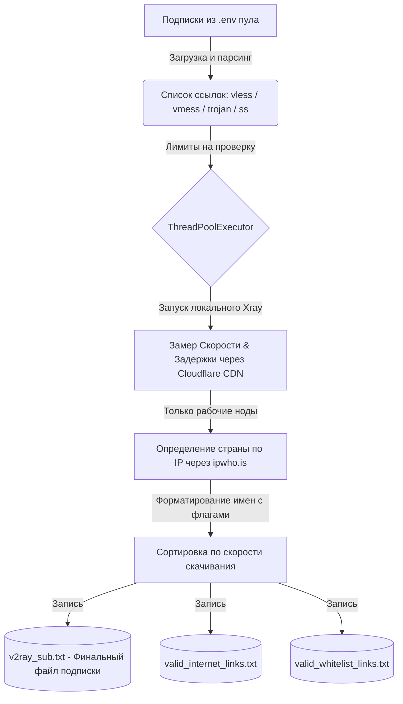
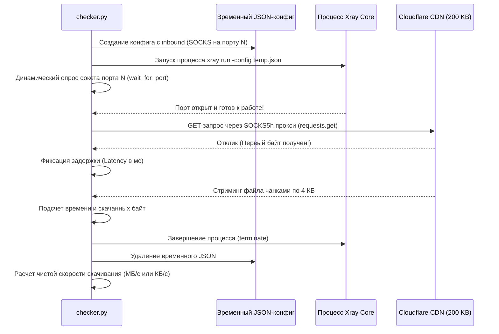

# xray-checker 🔍⚡

Простой, быстрый и эффективный асинхронный чекер подписок V2Ray / Xray на Python. Скрипт не просто проверяет доступность сервера ("пинг"), а измеряет **реальную скорость скачивания** через локально запущенное ядро Xray и автоматически формирует готовую подписку с флагами стран и замерами скорости.

---

## 🛠 Стек технологий

* **Язык**: Python 3.12.3
* **Сеть и Протоколы**: `requests` с поддержкой `PySocks` (`socks5h://` для безопасного резолва DNS на стороне прокси).
* **Ядро тестирования**: Официальный бинарник **Xray Core** (скачивается автоматически под архитектуру и ОС пользователя).
* **Параллелизм**: `ThreadPoolExecutor` (многопоточная проверка сотен конфигураций одновременно).
* **GeoIP**: Публичный API `ipwho.is` с кэшированием запросов через `functools.lru_cache` (для защиты от лимитов).
* **Конфигурация**: `python-dotenv` для удобного управления пулами подписок.

---

## ⚙️ Принцип работы

### 1. Общий конвейер (Pipeline)



### 2. Алгоритм тестирования одной ноды (Deep Dive)

Для каждой конфигурации выделяется уникальный локальный порт SOCKS (начиная с `20000`), через который прогоняется трафик:



---

## ⚡ Особенности реализации тестов скорости

* **Честный замер скорости**: Тест скачивает тестовый блок объемом **200 КБ** с глобального CDN Cloudflare (`https://speed.cloudflare.com/__down?bytes=204800`). Это не расходует много трафика пользователя, но дает точную картину пропускной способности.
* **Разделение метрик**: Логика разделяет задержку (время до первого байта / TTFB) и чистую скорость скачивания контента.
* **Безопасность портов**: Вместо слепого ожидания `time.sleep()`, скрипт динамически опрашивает сокет открытого локального SOCKS-порта, предотвращая сбои на перегруженных машинах.

---

## 🚀 Быстрый старт

### 1. Установка окружения

Склонируйте проект и настройте виртуальное окружение:

```bash
python3 -m venv .venv
source .venv/bin/activate
pip install -r requirements.txt
```

### 2. Настройка конфигурации (`.env`)

Создайте файл `.env` в корне проекта (или отредактируйте имеющийся):

```env
# Пулы ссылок на подписки (через запятую)
INTERNET_SUBS_POOL=https://example.com/sub1,https://example.com/sub2
WHITELISTED_SUBS_POOL=https://example.com/whitelist

# Лимиты и настройки проверки
INTERNET_CFGS_COUNT=10
WHITELISTED_CFGS_COUNT=500
CONCURRENT_THREADS_CHECK_DEFAULT=50
MAX_LINKS_TO_CHECK_INTERNET=1000
MAX_LINKS_TO_CHECK_WHITELIST=5000
```

### 3. Запуск чекера

```bash
python checker.py
```

Ядро Xray автоматически определит вашу операционную систему (macOS, Linux, Windows), архитектуру процессора (Intel/AMD/ARM), скачает актуальный релиз с GitHub в папку `xray_bin` и запустит тестирование.

По окончании работы скрипт создаст единый файл подписки [v2ray_sub.txt](file:///Users/radmir/xray-checker/v2ray_sub.txt), отсортированный по скорости скачивания, с красивыми именами нод:

`🇩🇪 ИНТЕРНЕТ 🌐 №1 2.4MB/s 95ms`
